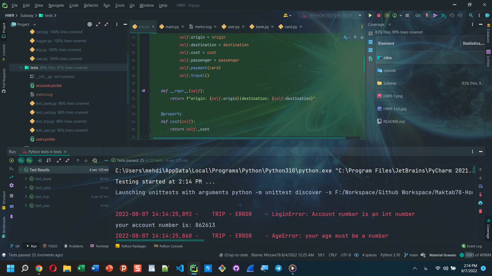
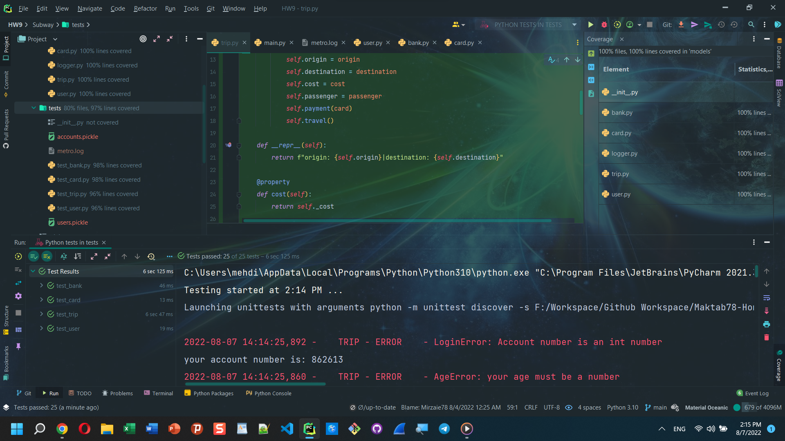

### Result Of Testing With tests package

---
+ __Subway package:__ 83% files, 99% lines covered

[//]: # (![alt text]&#40;F:\Workspace\Github Workspace\Maktab78-Homeworks\HW\HW9\Subway\Result of tests.png&#41;)

+ __models package:__ 100% files, 100% lines covered in 'models'

[//]: # (![alt text]&#40;F:\Workspace\Github Workspace\Maktab78-Homeworks\HW\HW9\Subway\Result of tests2.png&#41;)
[//]: # (![Screenshot]&#40;F:\Workspace\Github Workspace\Maktab78-Homeworks\HW\HW9\Subway\Result of tests2.png&#41;)
